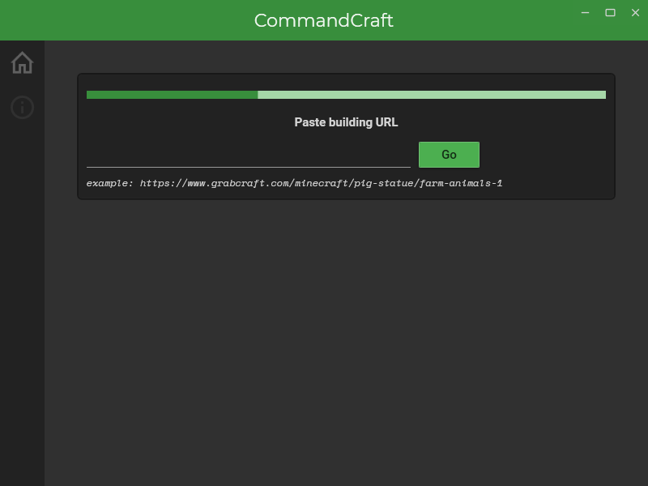
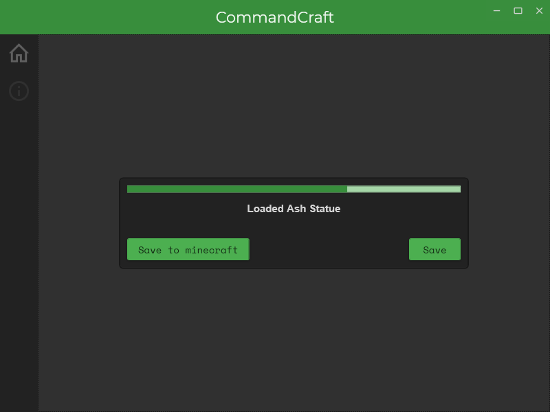
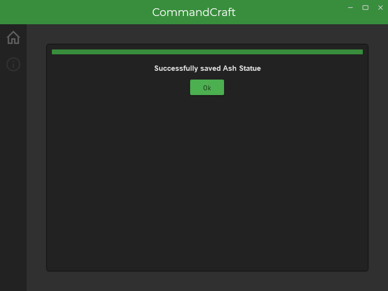
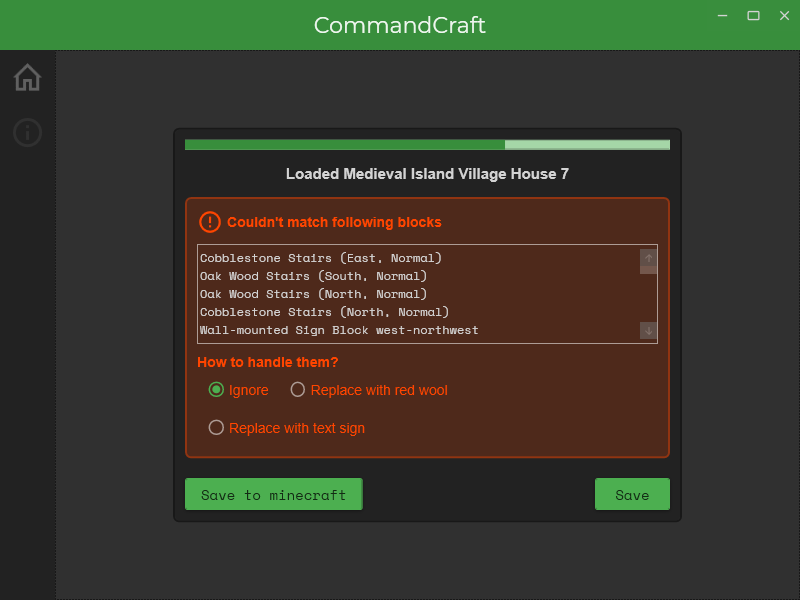

# CommandCraft
**Open source tool for generating minecraft commands using *grabcraft.com* buildings URLs.**
- - -
*Note that this is not an official minecraft program. It's not approved by or associated with mojang.*

*Also, note that I do not claim any rights to GrabCraft. 
GrabCraft and all related brands, names and content are the property of GrabCraft LLC. This is just a friendly application to help people in generating  in-game structures*
- - -
## Screenshots
..
- - -
## Download
Windows bin:
[CommandCraft v1.0.zip](https://github.com/mcw256/CommandCraft/releases/download/v1.0/CommandCraft.v1.0.zip)


## FAQ
**1. Minecraft doesn't detect .mcfunction, even though it's in the right location.**

This is very common issue. It probably means, that mcfunction contains a block that isn't in your minecraft version, or it was badly translated by CommandCraft. To fix this error, go to ```C:\Users\_thatsyou_\AppData\Roaming\.minecraft\logs```
, then open latest log file, and look for block that caused error.
After that, you can add your custom translation for this block to the ```programdata\user_block_dictionary.json``` file, which is loaded at the start by CommandCraft. On how to do that, look to quick guide below

**2. I'm getting an error trying to load to commandcraft one specific building, even though all the others are loading just fine**

Yeah, that can happen. There are several buildings on grabcraft that have corrupted blueprints. These ones you just gotta build by yourself xd.

- - -

## Quick guide on how to use CommandCraft
Almost everytime, you will see that orange rectangle showing you all the blocks that failed in translation process. You could just select to replace them with text sign and fix it in minecraft.
Or if you really want to have that full nice ```.mcfunction``` to do it all, you have two ways: save and edit .mcfunction file yourself, or... do it this way:
1. Go to the ```programdata``` folder and open ```user_block_dictionary.json``` file using text editor. *If you are not familiar with JSON syntax, read about it on the internet. It's not really complicated, but json files do a very good job as data input for programs.*
2. Next, copy, out of commandcraft, info about a block that failed to translate and then add it followed by your desired translation(keeping in mind JSON syntax) to ```user_block_dictionary.json``` *Example:*
```
"Cobblestone Stairs (West, Normal)": "minecraft:cobblestone_stairs[facing=west,half=bottom]",
```
**When translating block names, CommandCraft first checks ```user_block_dictionary.json``` for possible translation**, and if there are no matching elements, then it separates attributes and block names and uses 
```block_names_dictionary.json``` and ```block_attributes_dictionary.json``` for further translation. Btw. you can edit them as well, if you fell good with JSON.


